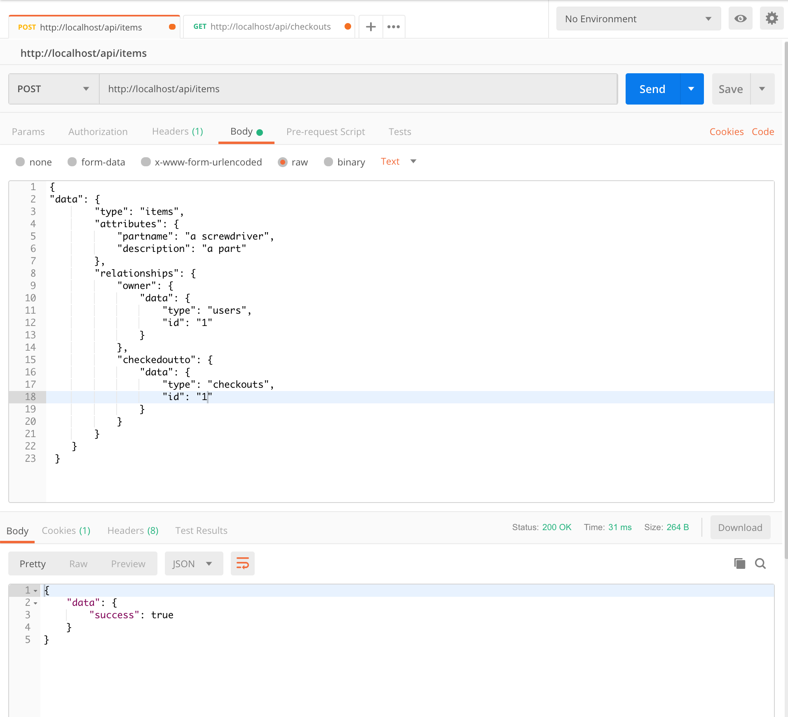
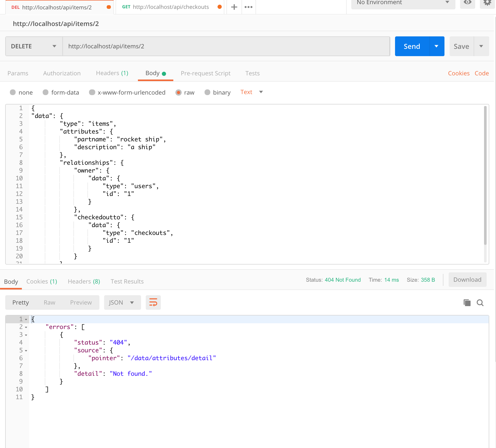
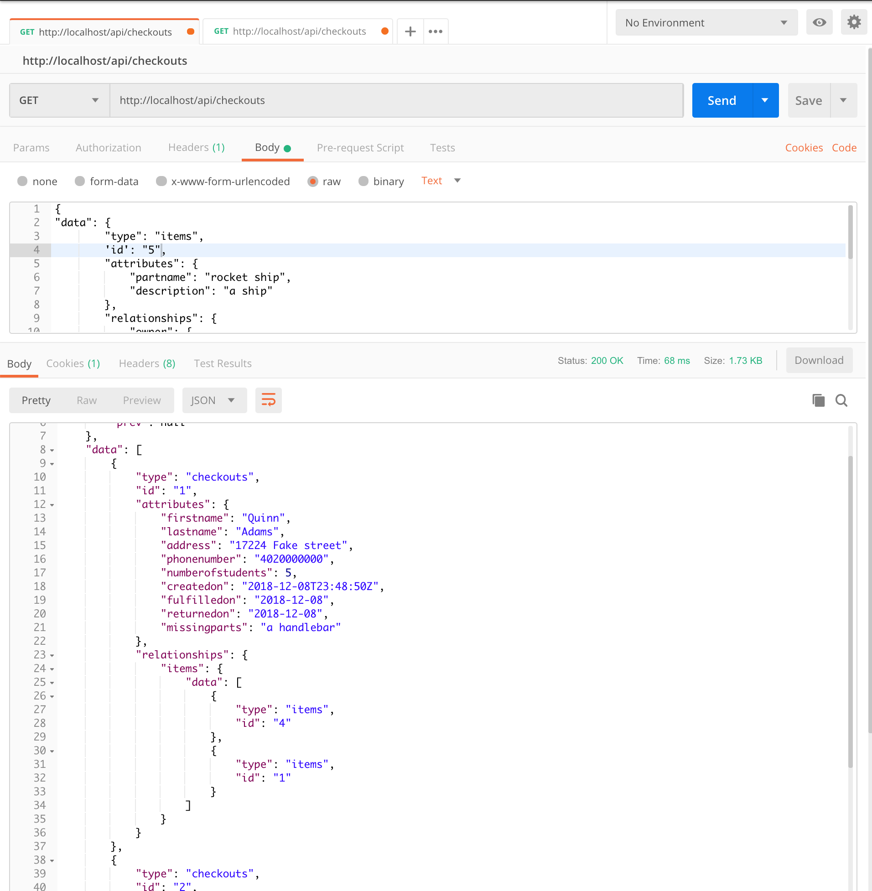
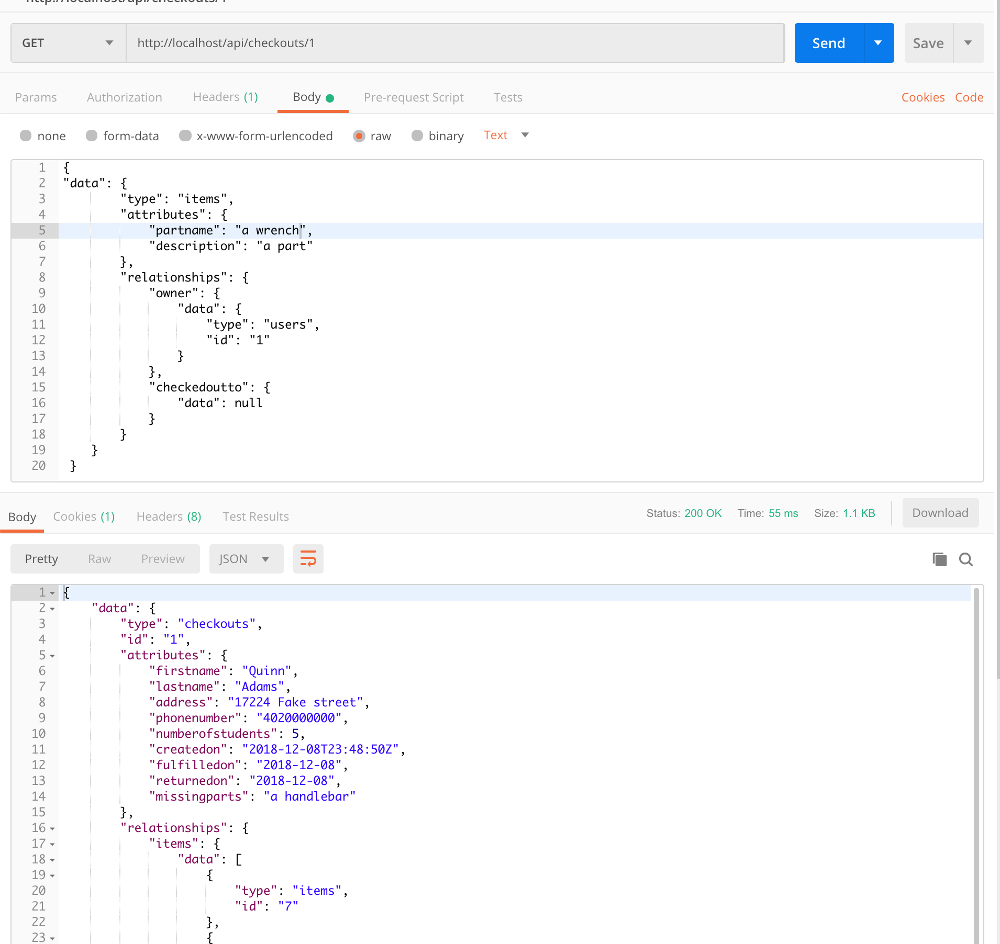
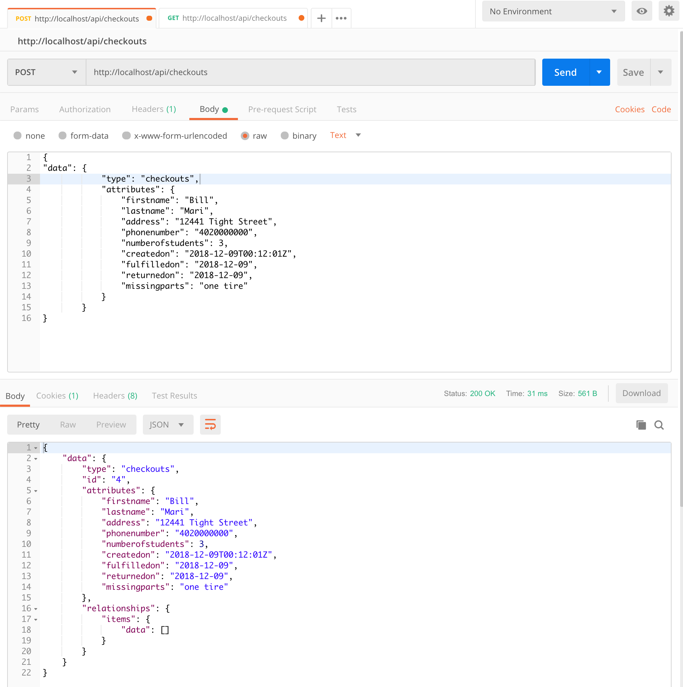
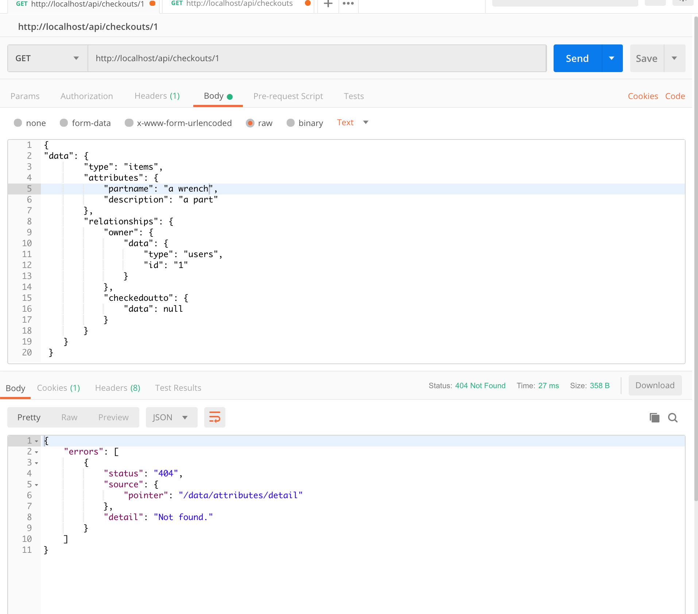

# This is the official postman tests for the backend

## Testing items

### GET /api/items
Status: Success

### GET /api/items/<id>
Status: Success

### POST /api/items with checkout attached
Status: Success

### POST /api/items without checkout attached
Status: Success

### DELETE /api/items/<id>
Status: Success seen by hitting send twice

### PUT /api/items/<id>
Status: Not Implemented or cannot be determined

## Testing checkouts

### GET /api/checkouts
Status: Success

### GET /api/checkouts/<id>
Status: Success

### POST /api/checkouts
Status: Success

### DELETE /api/checkouts/<id>
Status: Success seen by hitting send twice

### PUT /api/checkouts/<id>
Status: Not implemented or cannot be determined

