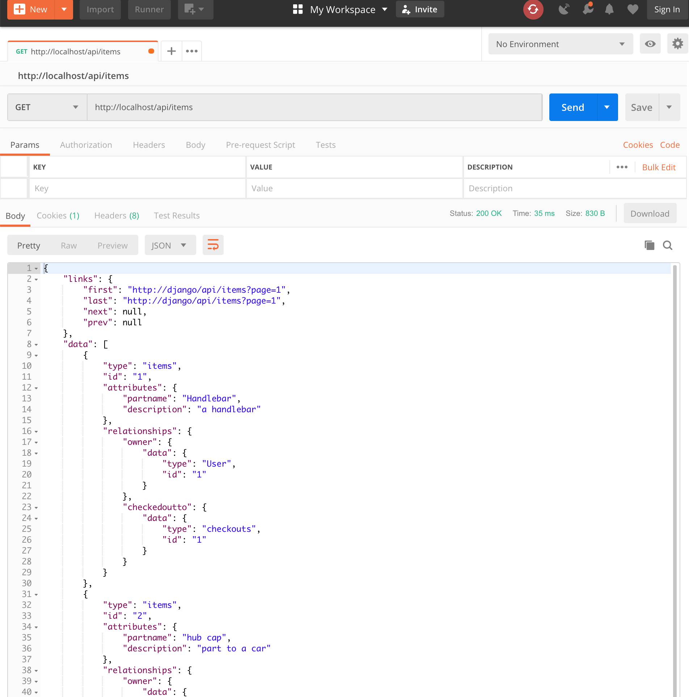
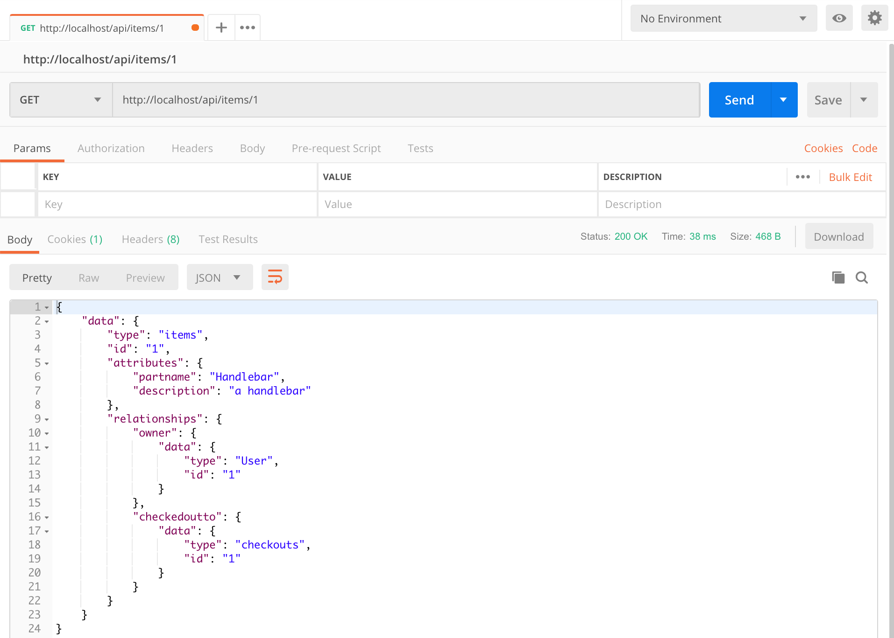

# This is the official postman tests for the backend

GET (list), POST to /api/dogs/
GET, PUT, DELETE to /api/dogs/<id>

## Testing items

### GET /api/items
Status: Success

### GET /api/items/<id>
Status: Success

